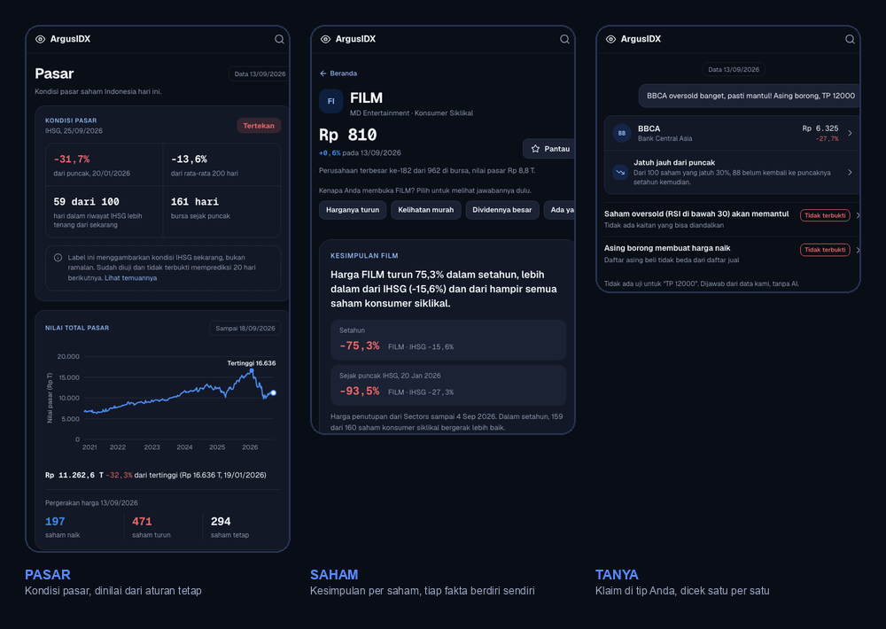
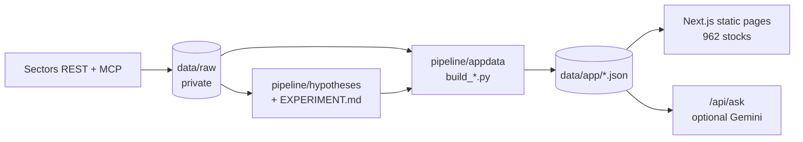

# ArgusIDX

[](https://github.com/dreadf/argusidx/actions/workflows/ci.yml)

**Market intelligence for the Indonesian stock exchange, tested against real
history.** ArgusIDX reads IHSG's current condition and which stocks are
actually driving it, gives every one of 962 listed companies a plain-language
read of its price, profit, valuation and dividend with no combined score, and
checks the tips and popular beliefs investors act on ("BBCA oversold banget,
pasti mantul! Asing borong...") against what has actually happened before. It
never says buy, sell or hold.

Built for the **Sectors Hackathon 2026**, Track 03 (Market Intelligence).
Live app: <https://argusidx.vercel.app>.



> Before acting on a stock: see what the market itself is doing, see what a
> company's own numbers and history say on their own terms, and see whether
> the idea behind a tip has ever held up. A first-time investor gets a floor
> under a claim that sounds too certain; an experienced trader gets the daily
> read done for them, the same way, every time.

## Problem statement

**In one sentence:** Indonesia's new retail investors act on tips and popular
beliefs ("oversold banget, pasti mantul", "asing borong") that nobody has
checked against IDX history, and they have no quick way to see either the
state of the market or whether the idea behind a tip has ever held up.

- **Who has the problem.** First-time retail investors, who are the fastest
  growing group on the exchange, and experienced traders who repeat the same
  daily market read by hand.
- **What goes wrong today.** A tip arrives with total certainty and no base
  rate. Screeners show signals as if they work, and we found none that
  publish whether they do. A market-wide read (what is driving IHSG, which
  stocks carry the fall) takes repeated work from raw data.
- **What ArgusIDX does about it.** It reads the market's condition, gives
  every one of 962 listed companies the same plain-language read with no
  combined score, and checks a pasted tip against what has actually
  happened. Of the 23 popular beliefs we tested, 4 held up.
- **What it will not do.** It never recommends buying, selling or holding,
  and never promises accuracy or profit.

### Ringkasan (Bahasa Indonesia)

Investor ritel baru di Indonesia sering bertindak berdasarkan tips dan
keyakinan populer yang belum pernah diuji dengan data bursa, dan tidak punya
cara cepat untuk melihat kondisi pasar atau apakah gagasan di balik sebuah tips
pernah terbukti. ArgusIDX membaca kondisi pasar, memberi setiap dari 962
perusahaan tercatat ringkasan yang sama tanpa skor gabungan, dan memeriksa
tips yang ditempel dengan data historis. Dari 23 keyakinan populer yang
diuji, 4 terbukti. Aplikasi ini berbahasa Indonesia dan hanya alat
informasi. Lihat bagian Disclaimer di bawah.

## Contents

1. [Problem statement](#problem-statement)
2. [Why this exists](#why-this-exists)
3. [What you can do in the app](#what-you-can-do-in-the-app)
4. [The research](#the-research) (what we tested, what held up, how we kept it honest)
5. [How Sectors powers it](#how-sectors-powers-it)
6. [Engineering](#engineering)
7. [Try it in three minutes](#try-it-in-three-minutes)
8. [Run it yourself](#run-it-yourself), [data and limits](#data-provenance-and-limits), [repo map](#repo-map)

## Why this exists

Indonesia's retail investor base is growing faster than its financial literacy.
KSEI counted **20.32 million** capital-market investors at the end of 2025, up 37%
from 14.87 million a year earlier ([KSEI, via IPOT, 29 Dec 2025](https://www.indopremier.com/ipotnews/newsDetail.php?jdl=KSEI__Jumlah_Investor_Pasar_Modal_di_2025_Melonjak_37__Jadi_20_32_Juta_SID&news_id=210837&group_news=IPOTNEWS&news_date=&taging_subtype=REGULATIONS&name=&search=y_general&q=KSEI&halaman=1)).
OJK's 2025 national survey put capital-market financial **literacy at 17.78% and
inclusion at 1.34%** ([OJK and BPS, SNLIK 2025](https://ojk.go.id/id/berita-dan-kegiatan/siaran-pers/Pages/OJK-dan-BPS-Umumkan-Hasil-Survei-Nasional-Literasi-Dan-Inklusi-Keuangan-SNLIK-Tahun-2025.aspx)).
Retail investors' share of trading rose from 38% (2024) to 50% by the end of 2025,
and OJK says it is targeting "saham gorengan" manipulation ([detik, 2 Jan 2026](https://finance.detik.com/bursa-dan-valas/d-8288678/porsi-transaksi-investor-ritel-naik-ojk-bidik-aksi-goreng-saham)).
In Sectors' own suspension data, 464 of 588 IDX trading suspensions were for
unusual price movement.

That gap isn't only about being misled by a bad tip. Building a genuine
market-wide read (what is actually driving IHSG's move today, which stocks are
dragging total market value down, where the pressure sits by sector) or a
disciplined per-stock read (five years of financials against peers, which of a
dozen possible warning signs are actually active right now) takes real,
repeated work from raw Sectors data. ArgusIDX does that work once, the same
way, for every one of 962 listed companies, in plain Bahasa Indonesia, with
one rule applied everywhere: a signal is shown on its own, never blended into
a score. That serves a first-time investor deciding whether to worry, and an
experienced trader who just wants the daily read done for them.

Tips travel through chat groups and social media. Screeners and flow trackers show
signals as if they work, and **none of them publish whether they actually do.**
ArgusIDX does not add another signal. It tests the signals people already believe,
shows the result, and keeps the failures on the page.

A tip also arrives with no picture of the market it lands in. As of this data
snapshot, IHSG itself is **31.7% below its 2026 peak** (20 Jan 2026), a state
ArgusIDX labels from a fixed rule, never a forecast. The app shows that
condition, and each stock's currently active situations, before any tip claim
is checked.

## What you can do in the app

The app is in Bahasa Indonesia; each section below names the page and what it does.

| Page | What you do | What you get |
|---|---|---|
| **Pasar** (market) | Check the market before checking a stock. | IHSG's current state against a fixed rule (tertekan / normal, described, never forecast), which stocks are bearing most of a market-wide fall and which large caps held up anyway, sectors sorted by how many of their stocks are near a 52-week low, tanda currently active market-wide, and today's biggest movers. |
| **Stock page** (`/saham/BBCA`, all 962 companies) | Search any listed company, or say why you opened it (price fell, looks cheap, a big dividend, someone recommended it, price jumped). | A plain-language summary (price, profit, valuation, dividend, each with its own state, never combined into one score), which popular signals are currently true for it with their test result, which situations to note with their base rate, and a data-backed answer for the reason you picked. |
| **Situasi** (situations) | Pick a situation, for example "a stock that fell 30% and is still below its old peak". | How often that has happened, and what followed, as "N of 100": "of 100 such stocks, 12 got back to their peak within a year". With a plausible range and the caveats. |
| **Temuan** (findings) | Open the list of 23 popular beliefs, tabbed with active tanda and rule-based rankings. | One verdict per belief (held up, unclear, did not hold up) with its sample size and its main limit. *Tanda*: stocks currently tripping one of 8 fixed rules, each with how often it is followed by what. *Peringkat*: lists ordered by one visible rule (for example ROE compared with similar companies). |
| **Tanya** (ask) | Paste a message you received, or type a question, from anywhere or from a stock page (already pointed at that stock, so you don't have to name it again). | The stock it mentions (price, and what situation it is in) and, for each claim in the message, whether we tested it and how it came out. Example: "oversold, pasti mantul" is matched to the oversold test and shown as "Tidak terbukti" (not proven). A claim we never tested, like a target price, is labelled "no test for this". The pasted text is read in your browser and never sent anywhere. Optional AI wording; without it, the same facts are shown as plain rows. |
| **Watchlist** | Star stocks. | Saved on your device, no account. Flags when something changes for a saved stock (a new situation or tanda, a dividend, an AGM, a suspension, or an insider report) since you last checked, compared entirely in the browser. |

## The research

Sectors asked for insight that is derived, not a reformatted view of raw data. The
core of this project is a research programme that tests popular market beliefs the
way a researcher would, and publishes every result.

**39 counted tests of 23 beliefs. 4 held up, 2 are unclear, 17 did not.**

| Belief | Result | What we found |
|---|---|---|
| Cheap stocks (low P/E) do better | Held up | Modest edge; **re-run on Sectors' own closing prices, it still holds** (ρ +0.08, p 0.004) |
| Small companies do better | Held up | **Re-run on Sectors prices: holds, strongly** (ρ −0.23) |
| High dividend yield means better returns | Held up, with a caveat | On Sectors prices, which exclude dividends, the association vanishes (ρ +0.01): part of the result is the dividend itself |
| A payout above earnings predicts a dividend cut | Held up | Cut rate rises from about 14% to 66% across payout groups; 79% for payouts above 100% in the holdout |
| Oversold (RSI below 30) means a bounce | Did not hold | |
| **"Asing borong": foreign net buying lifts the price** | Did not hold | Top-30 foreign-buy list against the top-30 sell list, 61 dates: 49 of 100 vs 50 of 100 beat the index over the next 5 days. The buy list had already risen before it was published |
| **Insiders buying lifts the price** | Not confirmed | Holdout +3.0% (p 0.25), median event about 0 |
| Positive news predicts a rise | Unclear | The two halves of the data disagree |
| Rising profits mean a rising share price | Did not hold | Correlation +0.00 on the holdout |
| Small free float means wild swings | Did not hold | The opposite: wide-float stocks are bumpier |

The full list is in [`docs/FINDINGS.md`](docs/FINDINGS.md); every sample, limit and
number is in [`EXPERIMENT.md`](EXPERIMENT.md).

**How we kept it honest**

- **Pre-registered.** Each test's rule, sample split and decision criterion is
  written in `EXPERIMENT.md` and committed to git *before* any result is computed.
  A trial counter records every test, including the ones that failed.
- **Explore, then holdout.** Ideas are found on one period and only "held up" if they
  also hold on a later period the search never saw.
- **Stress-tested after the fact.** We re-tested our newest results with variations
  fixed in advance (other windows, benchmarks, resampling by stock, permutation tests)
  and published 95% ranges for every "N of 100" figure. It found two situations that are
  fragile (the answer depends on the year or the counting method) and one wrong claim
  in our own copy (a date range), and we corrected all three on the pages.
- **Checked on Sectors' own prices.** Price outcomes came from a free public history
  during research. We then pulled Sectors' closing prices for all listed stocks on four
  dates through the MCP server and re-ran the three price findings. Two replicated; one
  did not, and the page says so.
- **Limits stay on the page.** Survivorship (delisted companies are missing), sample size
  and the one caveat that matters are next to every number.

## How Sectors powers it

| Sectors data | What it drives |
|---|---|
| `companies` (all 962 companies: fundamentals, price bands, banking and mining fields, index membership) | Stock pages, the 13 situations, anomaly signals, rankings, peer comparison |
| `suspensions` (588 events with IDX's stated reasons) | Suspension situations, the "repeat suspension" analysis |
| `filings` (insider buy and sell filings) | The insider-buying test, per-stock insider activity |
| `foreign-flow` (the full-market daily list, 61 usable dates) | The "asing borong" test |
| `news` (8,801 sentiment-tagged articles) | The news-sentiment tests |
| `idx-total`, `corporate-actions`, `mining` (commodity prices) | Market chart, dividend history, commodity context |
| `daily-close` through **MCP** (whole universe, 4 dates) | The re-check of the three price findings on Sectors prices |
| `daily` (per stock) | A 20-symbol cross-check of the research price history |

- **Two ways in.** REST for the bulk research pulls; a small MCP client
  (`pipeline/sectors_mcp.py`) that speaks JSON-RPC to the Sectors MCP server, with a
  billing guard and a call log. The full-market foreign-flow list has no MCP tool, so
  that test uses REST.
- **Every call is accounted for.** [`docs/credit_ledger.md`](docs/credit_ledger.md) logs each
  billed call with its reason: the 1,000-credit hackathon pool is fully spent, and the
  build now draws on a separate 600-credit balance (expiring 2027), 109 of which are
  spent so far.
- **Nothing calls Sectors at request time.** Every number is precomputed, so the app
  does not depend on any API being reachable.
- **The foreign-flow test is new to us.** We found no published test of the retail
  version of the claim (does the daily top-foreign-buy list predict the next weeks); it uses
  the feed as retail apps show it, with each day's list built from that day's data only.

## Engineering



- **562 Python tests and 207 frontend tests**, run by CI on every push together with
  a secret scan and a production build ([`ci.yml`](.github/workflows/ci.yml)).
- **Guards against expensive mistakes:** the client refuses queries below Sectors' data
  floor (they return empty and still bill), unknown tickers, and billed MCP calls
  without an explicit flag.
- **Reproducible:** `scripts/rebuild_app_data.sh` rebuilds every data file; each
  hypothesis is one module you can run and compare with `EXPERIMENT.md`.
- **Advice-language scan:** a script fails the build if user-facing text turns into a
  recommendation. The app works with the LLM switched off.
- More in [`docs/ARCHITECTURE.md`](docs/ARCHITECTURE.md) and [`docs/DATA.md`](docs/DATA.md).

## Try it in three minutes

1. **Pasar:** `/pasar` for IHSG's current state, which stocks are dragging the market down, the sectors under the most pressure, and today's movers.
2. **A stock page:** `/saham/ASII`, then pick a reason ("kelihatan murah") to see the answer built for it.
3. **Situasi:** open "Masih di bawah puncak lama".
4. **Temuan:** open "Asing borong membuat harga naik" and read the chart and the limits.
5. **Tanya:** paste "BBCA oversold banget, pasti mantul! Asing borong, TP 12000". You get BBCA and each claim checked; the target price is marked untested.
6. **Sumber data:** `/temuan/sumber-data` shows the Sectors endpoints and the credit count.

## Run it yourself

```bash
cd frontend && npm ci && npm run dev      # http://localhost:3000, no keys needed
```

Tests, rebuilding the data and the optional Gemini key: [`docs/SETUP.md`](docs/SETUP.md).

## Data provenance and limits

| What | Source | Live or frozen |
|---|---|---|
| Stock snapshot, peers, flags, rankings, suspensions, insider filings, corporate actions, market cap | Sectors | Snapshot, dated on every page (13 Sep 2026) |
| Foreign-flow and insider-buying tests; Sectors closes for the re-check | Sectors | Frozen research results |
| Most price outcomes, drawdown and recovery base rates | Free public price history (research only, never shipped) | Frozen, dated |

`data/raw/` (the purchased data) is kept in a private repository, because Sectors'
terms do not allow republishing it; the app and all derived data (`data/app/`) are
here. Data is frozen at submission, as the rules require. Sources for the facts above:
[`docs/SOURCES.md`](docs/SOURCES.md). Notes may still mention internal planning files
(`RULES.md`, `BACKLOG.md`, `docs/PLAN.md`, `docs/PRODUCT.md`) that are not part of
this repository.

## Repo map

`pipeline/` research modules and data builders, `frontend/` the Next.js app,
`data/app/` what the app reads, [`EXPERIMENT.md`](EXPERIMENT.md) the research log,
[`docs/`](docs/) findings, sources, data dictionary, credit ledger, setup and
architecture.

## Disclaimer

ArgusIDX is an information and analysis tool. It is not financial advice and never
recommends buying, selling, or holding any security. Everything shown describes
historical, statistical relationships in past IDX data; they are not predictions and
not guarantees. To check whether an offer is legal and logical, contact OJK on 157.
