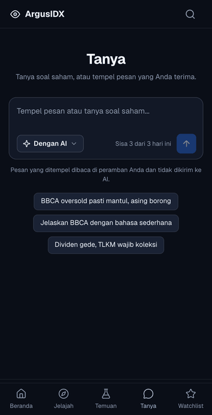
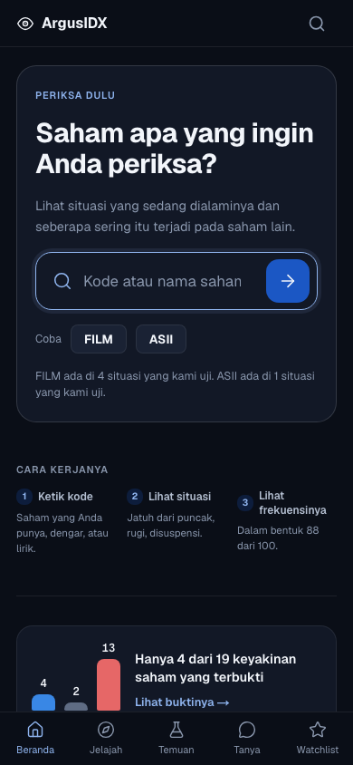
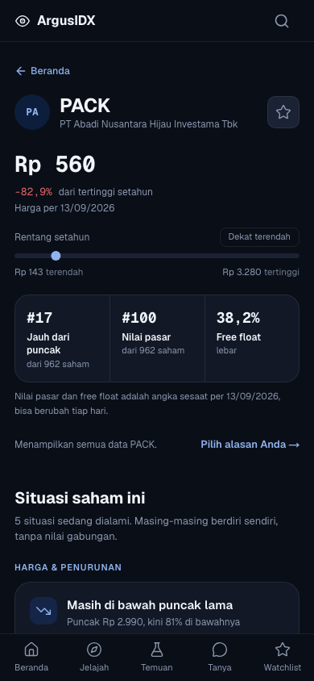
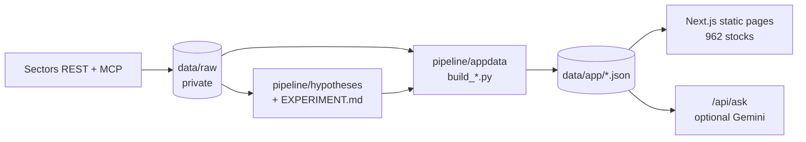

# ArgusIDX

[](https://github.com/dreadf/argusidx/actions/workflows/ci.yml)

> For Indonesia's millions of new retail investors, ArgusIDX checks the tips
> and popular beliefs they act on against IDX data, and shows what has
> actually held up.

Built for the **Sectors Hackathon 2026**, Track 03 (Market Intelligence).
Bahasa Indonesia, mobile-first, no account, no backend to keep running.

| Paste a tip (Tanya) | Beranda | A stock's page |
|---|---|---|
|  |  |  |

## The problem

Indonesia's retail investor base is growing faster than its financial
literacy. KSEI counted **20.32 million** capital-market investors at the end
of 2025, up 37% from 14.87 million a year earlier ([KSEI, via IPOT, 29 Dec
2025](https://www.indopremier.com/ipotnews/newsDetail.php?jdl=KSEI__Jumlah_Investor_Pasar_Modal_di_2025_Melonjak_37__Jadi_20_32_Juta_SID&news_id=210837&group_news=IPOTNEWS&news_date=&taging_subtype=REGULATIONS&name=&search=y_general&q=KSEI&halaman=1)).
OJK's 2025 national survey put capital-market financial **literacy at 17.78%
and inclusion at 1.34%** ([OJK and BPS, SNLIK 2025](https://ojk.go.id/id/berita-dan-kegiatan/siaran-pers/Pages/OJK-dan-BPS-Umumkan-Hasil-Survei-Nasional-Literasi-Dan-Inklusi-Keuangan-SNLIK-Tahun-2025.aspx)).
Retail investors' share of trading rose from 38% in 2024 to 50% by the end
of 2025, and OJK has said it is targeting "saham gorengan" price
manipulation ([detik, 2 Jan 2026](https://finance.detik.com/bursa-dan-valas/d-8288678/porsi-transaksi-investor-ritel-naik-ojk-bidik-aksi-goreng-saham)).
In our own Sectors suspension data, 464 of 588 IDX trading suspensions
were for unusual price movement.

Tips arrive in chat groups and social media. Screeners and flow trackers show
signals as if they work, and **none of them publish whether they actually do.**
ArgusIDX does not add a new signal. It publishes honest, tested evidence
about the signals people already believe, and never tells anyone what to do.

## What it does

| The moment | What ArgusIDX does |
|---|---|
| A friend sends a stock tip | **Tanya**: paste it. The stock and each claim ("oversold", "asing borong") are matched to what we tested. Read entirely in your browser; the pasted text is never sent anywhere. |
| "Is that belief actually true?" | **Temuan**: 19 popular beliefs, tested against IDX data with their real sample sizes and limits. 4 held up, 2 are unclear, 13 did not. |
| "My stock fell a lot. Is that normal?" | **Situasi**: 13 situations (a big fall, a suspension, an IPO, a loss year...) as natural frequencies, "88 of 100 had not recovered a year later", never a forecast for one stock. |
| "What looks unusual right now?" | **Deteksi anomali**: nine rule-based signals, each with its count, its base rate and its sensitivity. |
| "Which stocks stand out on one open rule?" | **Peringkat**: six lists, each ordered by one visible rule. No combined score. |

Every one of the 962 IDX-listed companies has its own page. Questions can
also be typed: an LLM (Gemini, optional) may word the answer, every number in
it is checked against the retrieved facts, and without a key or after the
3-per-day allowance the same facts are shown without AI.

## How we test, and what we found

- Each hypothesis is **pre-registered with its explore/holdout split before
  any outcome is computed**, run once, and reported whether it passes or fails.
  The log is [`EXPERIMENT.md`](EXPERIMENT.md), with a **trial counter (35)**.
- A belief is only "proven" if it holds on data the search never saw.
- Nulls get the same space as positives. Descriptive base rates are not
  counted as tests.
- Survivorship, sample size and the single limit that matters most are shown
  next to every result.

**Held up (4):** cheap stocks (low P/E), high dividend yield, small companies,
and "a dividend larger than earnings predicts a dividend cut" (checked with a
placebo and three ways of handling missing dividends). Re-run on Sectors' own
prices, cheap P/E and small size hold; the dividend-yield result only appears
when dividends count as part of the return.
**Unclear (2):** price-spike suspensions, and positive news.
**Did not hold (13):** oversold bounces, trend and moving-average rules, ROE,
debt, revenue growth, combined signals, insider selling, small free float,
earnings growth, and the two newest tests, **"foreign buying lifts the price"**
(the daily top-30 foreign-buy list against the top-30 sell list, 61 days) and
**"insiders buying lifts the price"**.

## Built on Sectors

| | |
|---|---|
| **Data** | Fundamentals and price bands for all 962 companies, suspensions with IDX's stated reasons, insider filings, corporate actions, peer groups, banking and mining fields, IDX total market cap, IPO listing performance, the daily foreign-flow list. |
| **Access** | REST for the bulk research pulls; an MCP client (`pipeline/sectors_mcp.py`, JSON-RPC over the Sectors MCP server, with a billing guard and a call log) for the daily-close feed used to re-check the price findings, and for probes. The full-market foreign-flow list has no MCP tool, so that test uses REST. |
| **Credits** | 864 of 1,000 used, every call logged with its reason in [`docs/credit_ledger.md`](docs/credit_ledger.md). |
| **At request time** | Nothing. Every number is precomputed, so judging does not depend on any API being reachable. |
| **Price cross-check** | Price outcomes come from a free public history (development only, never shipped), checked against Sectors' own daily closes on a sample of 20 symbols (identical on 1,218 matched days). The three findings that held up on prices were then **re-run on Sectors' closing prices for all listed stocks**: cheap P/E and small size hold; the dividend-yield result does not once dividends are left out of the return. |

## Architecture



More in [`docs/ARCHITECTURE.md`](docs/ARCHITECTURE.md).

## Run it

```bash
cd frontend && npm ci && npm run dev      # http://localhost:3000, no keys needed
```

Tests: `python -m pytest pipeline/tests scripts` (358) and `npm test` (159).
Full instructions, rebuilding the data and the optional Gemini key:
[`docs/SETUP.md`](docs/SETUP.md).

## Data provenance

| What | Source | Live or frozen |
|---|---|---|
| Stock snapshot, peers, flags, rankings, suspensions, insider filings, corporate actions, IPO fields, market cap | Sectors | Snapshot, dated on every page (data as of 13 Sep 2026) |
| Foreign-flow and insider-buying tests | Sectors daily lists and filings, with price outcomes from the research history | Frozen research results |
| Beat-gold, drawdown and recovery base rates, other price outcomes | Research price history | Frozen, dated |

`data/raw/` (the purchased data) is kept in a private data repository:
Sectors' terms do not allow republishing it. The app and all derived data
(`data/app/`) are here. Data is frozen at submission, as the rules require.
All Sectors-sourced data is provided by [Sectors](https://sectors.app).

## Repo layout

`pipeline/` research and builders, `frontend/` the Next.js app, `data/app/`
what the app reads, [`EXPERIMENT.md`](EXPERIMENT.md) the research log,
[`docs/`](docs/) plan, product spec, sources ([`SOURCES.md`](docs/SOURCES.md))
and the credit ledger, [`RULES.md`](RULES.md) the hackathon rules and our
process rules.

## Disclaimer

ArgusIDX is an information and analysis tool. It is not financial advice and
never recommends buying, selling, or holding any security. Everything shown
describes historical, statistical relationships in past IDX data. They are
not predictions and not guarantees. To check whether an offer is legal and
logical, contact OJK on 157.
