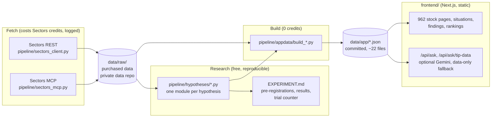

# Architecture

ArgusIDX has no database and no server-side state. Everything the app shows
is precomputed into JSON, and the Next.js app only reads it.

## Layers

| Layer | Where | Rule |
|---|---|---|
| Fetch | `pipeline/sectors_client.py` (REST), `pipeline/sectors_mcp.py` (MCP over JSON-RPC) | No call without a stated cost and approval. Every call is logged in `docs/credit_ledger.md`, and MCP calls also in `data/mcp_call_log.jsonl`. `pipeline/guards.py` blocks queries below the 2021-01-01 data floor and unknown tickers. |
| Raw data | `data/raw/` | Purchased, so it lives in a private data repo and is not in this public repository. |
| Research | `pipeline/hypotheses/` | Each hypothesis is pre-registered in `EXPERIMENT.md` with its explore/holdout split before any outcome is computed, run once, and reported whether it passes or fails. |
| Build | `pipeline/appdata/build_*.py` | Pure functions from raw data and research results to `data/app/*.json`. `scripts/rebuild_app_data.sh` runs them all; `build_stock_pages` runs last because it embeds the situations and flags. |
| App | `frontend/` | Reads `data/app/` only. Nothing calls Sectors at request time. All 962 stock pages are static HTML. |

## The question box

`/tanya` is one input. A pasted message is read entirely in the browser by
the deterministic tip reader (`frontend/src/lib/ask/tip-reader.ts`): it finds
stock codes and claims and matches them to tested findings and situations. The
pasted text is never sent to a server or to an LLM. A question goes to
`/api/ask`, which retrieves facts from the JSON files, and an LLM (Gemini) may
word the answer from them. Every number in an AI answer is checked against
those facts. With no key, with the allowance used up (3 per rolling 24 hours,
signed cookie plus a per-IP backstop), or in "Data saja" mode, the answer is
built from the same facts without AI.

## Where price history comes from

Price outcomes ("what happened 90 days later") need multi-year daily prices for
hundreds of stocks, which would cost far more Sectors credits than the whole
budget. Those series come from a free public source used only during
development (`pipeline/dev/`, never imported by the app), are frozen into
derived facts, and are cross-checked against Sectors' own daily closes on a
sample of symbols. The three "proven" findings are re-checkable that way.

## Tests and checks

- `pytest pipeline/tests scripts` (358 tests): statistics, guards, builders, one test module per hypothesis.
- `npm test` in `frontend/` (159 tests): the tip reader, question classifier, advice-language guard, view models.
- `scripts/check_no_secrets.py`, `scripts/check_no_advice_language.py`, `scripts/check_no_em_dash.py`, `scripts/preflight.sh` (production build, with the LLM switched off).
- `.github/workflows/ci.yml` runs the tests, both scans and the production build on every push.
